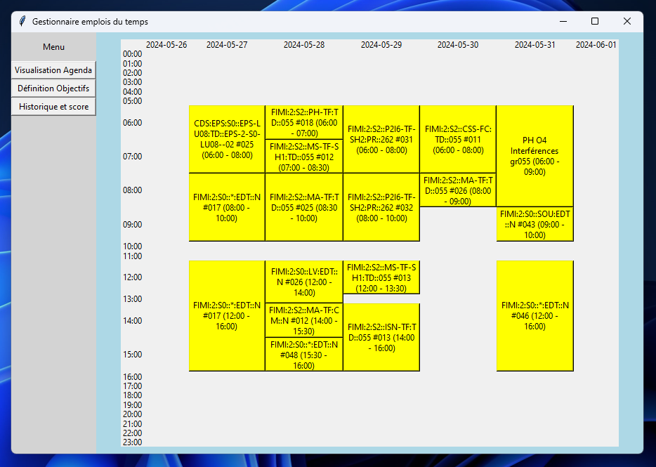
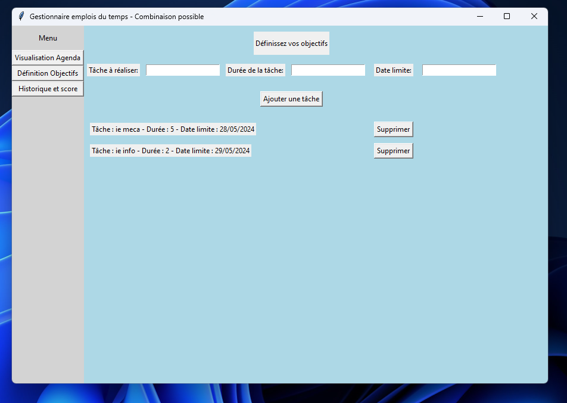
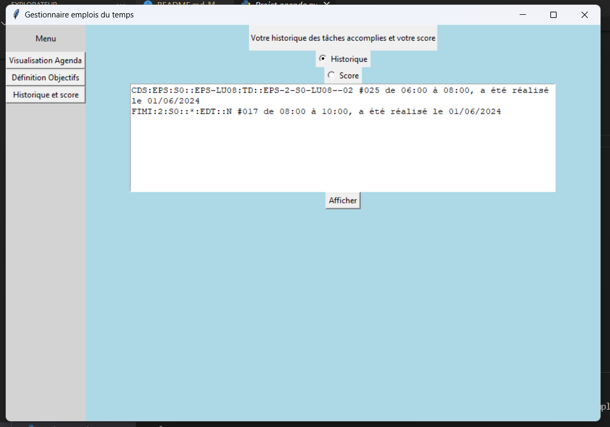
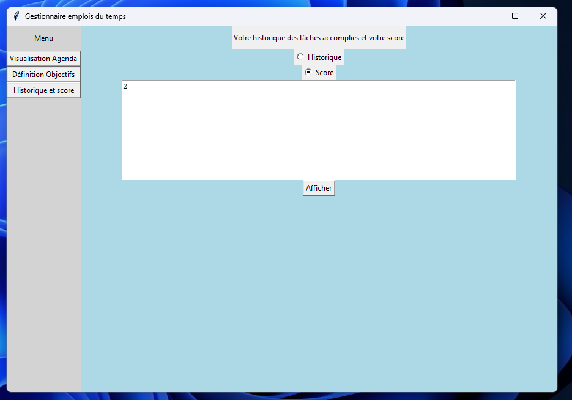

# Plannificateur d'Agenda
### Ouvrir le projet

Commencez par décompresser le dossier du projet.

Pour installer le(s) bibliothèque(s) nécessaire(s), veuillez utiliser la commande iuivante dans spyder5 :
```sh
pip install ics
pip install icalendar
```

Enfin lancez le projet en éxecutant le fichier : 'interface.py'

Afin de tester l'application, nous vons proposons d'utiliser le lien d'emplois du temps suivant : 

```
https://ade-outils.insa-lyon.fr/ADE-Cal:~llhomme!2023-2024:a5c217dab6bd6040d9f1cf0f3285b7242f936f18
```

De plus, dans la mesure où le test réalisé par les professeurs se fera durant une période où les étudiants n'ont plus cours, alors on a modifié le code pour que la "date actuelle" soit le 03/06/2024. Ainsi ces derniers auront accès à un agenda plus fourni où l'on peut constater le concept non trivial de notre algorithme.


### Overview du projet

Lorsqu'on lance l'application


Ensuite lorsqu'on donne un lien d'emplois du temps (ex : "https://ade-outils.insa-lyon.fr/ADE-Cal:~[YOUR INSA ID]!2023-2024:a5c217dab6bd6040d9f1cf0f3285b7242f936f18") on obtient cette page :


Dans l'onglet "Défintions Objectifs" : 

Avec cette interface on peut ajouter de nouveaux objectifs. De plus on peut avoir la liste de ces derniers, ainsi que la possibilité des les suprimer.

Enfin on à le dernier onglet, représentant l'historique et le score de l'utilisateur
* Historique :

* Score :

