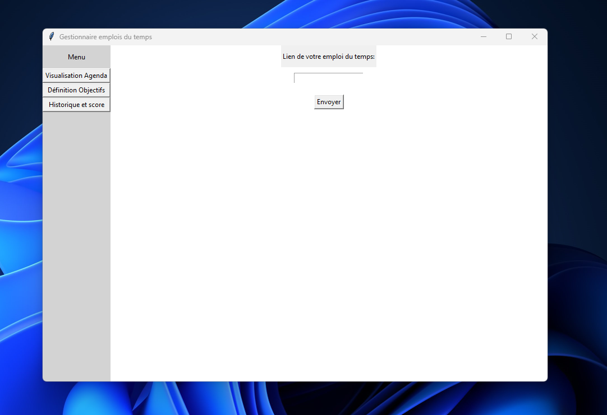

# Plannificateur d'Agenda

### Overview du projet

Lorsqu'on lance l'application


Ensuite lorsqu'on donne un lien d'emplois du temps (ex : "https://ade-outils.insa-lyon.fr/ADE-Cal:~[YOUR INSA ID]!2023-2024:a5c217dab6bd6040d9f1cf0f3285b7242f936f18") on obtient cette page :


Dans l'onglet "Défintions Objectifs" : 

Avec cette interface on peut ajouter de nouveaux objectifs. De plus on peut avoir la liste de ces derniers, ainsi que la possibilité des les suprimer.

Enfin on à le dernier onglet, représentant l'historique et le score de l'utilisateur
* Historique :

* Score :


### Récupération les évenements des x:int prochains jours 
x=0 représente aujourd'hui, x=1 représente demain, ..., x=i représente le xème jour inclus.

```python
ics_url = "https://ade-outils.insa-lyon.fr/ADE-Cal:~llhomme!2023-2024:a5c217dab6bd6040d9f1cf0f3285b7242f936f18"

agenda = Agenda_data(ics_url)
events = agenda.get_events_for_next_x_day(3)
```

on obtient alors : 
```json
{'2024-04-04': [
    {'summary': 'FIMI:2:S2::MA-TF:TD::055 #016', 'start_time': '08:00', 'end_time': '09:00'}, 
    {'summary': 'FIMI:2:S2::CSS-FC:TD::055 #006', 'start_time': '06:00', 'end_time': '08:00'}
    ],
'2024-04-05': [
    {'summary': 'PH O1 Câble gr055', 'start_time': '06:00', 'end_time': '09:00'}, 
    ......
    {'summary': 'FIMI:2:S0::*:EDT::N #041', 'start_time': '12:00', 'end_time': '16:00'}
    ], 
    '2024-04-06': [], 
    '2024-04-07': []
    }
```
les liste vides représentent les jours sans cours (weekend, jour ferié..)

### recuperation des objectifs plannifiés

```python

agenda_URL = "https://ade-outils.insa-lyon.fr/ADE-Cal:~llhomme!2023-2024:a5c217dab6bd6040d9f1cf0f3285b7242f936f18"

c = Controller()
c.init_agenda_data(agenda_URL)

c.post_list_objectifs([
    {"name":"IE meca", "deadline":"23/04/2024", "temps":6},
    {"name":"IE math", "deadline":"21/04/2024", "temps":6}
])

print(c.get_plannification_automatique())

c.local_storage.save_data()
```
Et on obtient donc par exemple avec des journée de travaille bornée entre 8h et 21h, sachant qu'on est en vacances donc agenda = { 'DD-MMM-YY' :  []} => temps libre = [{'start':'8:00', 'end' : '12:00'},{'start':'14:00', 'end':'21:00'}] :
```json
{'2024-04-20': [
    {'summary': 'pause repas', 'start_time': '12:00', 'end_time': '14:00'},
    {'summary': 'IE meca', 'start_time': '08:00', 'end_time': '12:00'},
    {'summary': 'IE meca', 'start_time': '14:00', 'end_time': '16:00'},
    {'summary': 'IE math', 'start_time': '16:00', 'end_time': '21:00'}
],
'2024-04-21': [
    {'summary': 'pause repas', 'start_time': '12:00', 'end_time': '14:00'},
    {'summary': 'IE math', 'start_time': '08:00', 'end_time': '09:00'}
],
'2024-04-22': [
    {'summary': 'pause repas', 'start_time': '12:00', 'end_time': '14:00'}
],
'2024-04-23': [], '2024-04-24': [], '2024-04-25': [], '2024-04-26': []}
```
